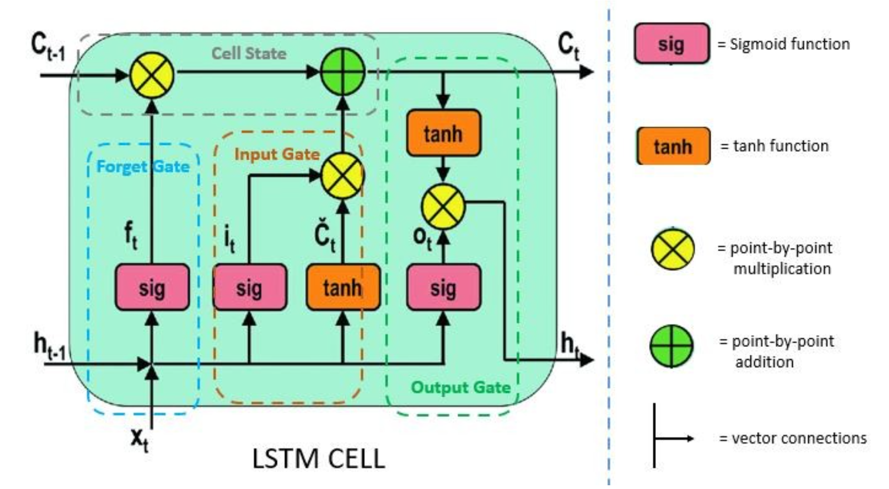
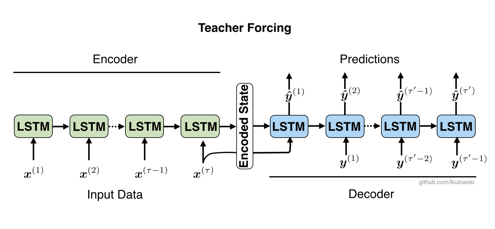

# NMT English → Vietnamese (RNN + Attention, from scratch)

A learning project: reimplementing a neural machine translation (NMT) model
for English → Vietnamese from scratch in PyTorch, deliberately split into two
stages so the underlying mechanisms are understood before adding refinements:

1. **Stage 1 — Plain Seq2Seq LSTM, NO Attention** *(in progress)*: the Encoder
   compresses the entire source sentence into a single context vector (its
   final hidden/cell state), and the Decoder decodes from that. The goal is to
   actually feel the "bottleneck" limitation of the original Seq2Seq
   architecture firsthand.
2. **Stage 2 — Add Luong Attention** *(not started)*: based on
   Luong, Pham, Manning (2015), *"Effective Approaches to Attention-based
   Neural Machine Translation"* — the Encoder returns all hidden states, and
   the Decoder attends over them (dot / general / concat scoring) with input
   feeding, then BLEU is compared against the Stage 1 baseline to see exactly
   what Attention improves.

Code favors clarity and comments explaining *why*, not performance. When
learning a new mechanism (LSTM cell, Attention...), always hand-code it first
and cross-check against the equivalent PyTorch module (`nn.LSTMCell`) before
switching to the built-in module (`nn.LSTM`) for the rest.

## Dataset

[IWSLT15 English-Vietnamese](https://nlp.stanford.edu/projects/nmt/) (Stanford NLP Group):

| Split | File | Sentences |
|---|---|---|
| train | `train.en` / `train.vi` | 133,317 |
| dev | `tst2012.en` / `tst2012.vi` | 1,553 |
| test | `tst2013.en` / `tst2013.vi` | 1,268 |

Downloaded via `MachineTraslation/scripts/download_data.sh` (uses `curl -L`,
mirrored from the GitHub repo `stefan-it/nmt-en-vi`), extracted into
`MachineTraslation/data/raw/`.

## LSTM mechanics (foundation for both stages)

A vanilla RNN can suffer from *vanishing gradients* on long sequences — the
gradient shrinks toward zero across time steps, causing the model to "forget"
early context. LSTM fixes this by adding a separate memory path called the
**cell state** $c_t$, updated through **addition** instead of repeated
multiplication — which keeps gradients more stable.

At each time step, given the current input $x_t$, the previous hidden state
$h_{t-1}$, and the previous cell state $c_{t-1}$:

$$
\begin{aligned}
i_t &= \sigma(x_t W_{xi} + h_{t-1} W_{hi} + b_i) && \text{Input gate — how much new information to add} \\
f_t &= \sigma(x_t W_{xf} + h_{t-1} W_{hf} + b_f) && \text{Forget gate — how much old memory to keep} \\
\tilde{c}_t &= \tanh(x_t W_{xc} + h_{t-1} W_{hc} + b_c) && \text{Candidate — the new content that could be written} \\
o_t &= \sigma(x_t W_{xo} + h_{t-1} W_{ho} + b_o) && \text{Output gate — how much of the cell state is exposed as hidden state}
\end{aligned}
$$

The cell state and hidden state are then updated as:

$$
c_t = f_t \odot c_{t-1} + i_t \odot \tilde{c}_t
$$

$$
h_t = o_t \odot \tanh(c_t)
$$

The **addition** in the $c_t$ equation is the "memory highway" — a direct path
that keeps gradients from vanishing across many steps the way they do in a
vanilla RNN.



*Yellow nodes = element-wise multiplication ($\odot$), green nodes =
element-wise addition. The diagram maps directly onto the four equations
above: `Forget Gate` → $f_t$, `Input Gate` → $i_t$ and $\tilde{c}_t$,
`Output Gate` → $o_t$, and the top horizontal line (`Cell State`) is the
additive path $c_{t-1} \to c_t$.*

A step-by-step walkthrough (forget → input/candidate → cell state update →
output) is available in
`MachineTraslation/notebooks/04_model_rnn_basics.ipynb`, along with a
hand-written `nn.LSTMCell` cross-check against the actual PyTorch
implementation.

## Teacher Forcing (used when training the Decoder)



During training, instead of letting the Decoder feed on its own previous
prediction (which can compound errors if it guesses wrong early on), we
"force" the input at step $t$ to be the **ground-truth** token $y^{(t-1)}$
from the label — hence *teacher forcing*. The Encoder processes the entire
source sentence, and its final state (`Encoded State`) initializes the
Decoder; the Decoder then generates each $\hat{y}^{(t)}$ one at a time, always
receiving the **real** token as input for the next step during training (at
inference time there is no label, so it must feed on its own $\hat{y}^{(t)}$
instead — an important train/inference discrepancy to keep in mind).

## Directory layout

```
D:\AIResearcher\
├── images\                        # shared diagrams used by the notebooks (and this README)
├── MachineTraslation\
│   ├── data\
│   │   ├── raw\                   # the 6 downloaded + extracted IWSLT15 en-vi files
│   │   └── processed\             # vocab (.pkl) + numericalized data
│   ├── notebooks\
│   │   ├── 02_preprocess.ipynb    # done — tokenize (EN: regex, VI: underthesea), build Vocab, save pickles
│   │   ├── 03_dataset.ipynb       # done — Dataset + DataLoader, padding, tgt_input/tgt_output split
│   │   └── 04_model_rnn_basics.ipynb  # in progress — LSTM cell (theory + hand-coded), Encoder/Decoder WITHOUT Attention
│   ├── scripts\
│   │   └── download_data.sh       # download + extract the dataset
│   └── src\
│       └── vocab.py               # shared Vocab class across notebooks (word2idx/idx2word, encode/decode)
├── tensor\                         # separate self-attention/transformer study notebooks — NOT part of this project
├── venv\                           # Python virtualenv
└── requirements.txt
```

Planned next steps: `05_train_baseline` (train + evaluate Stage 1) →
`06_model_attention` (add Luong Attention) → `07_train_attention` →
`08_evaluate` (BLEU) → `09_translate` (translate new sentences).

## Setup & running

```bash
# create venv, install dependencies
python -m venv venv
venv\Scripts\python.exe -m pip install -r requirements.txt

# download the IWSLT15 en-vi dataset
bash MachineTraslation/scripts/download_data.sh
```

**GPU (optional)**: `pip install torch` installs a CPU-only build by default.
If you have an NVIDIA GPU, install the CUDA build matching your driver, e.g.
(driver supporting CUDA 12.6):
```bash
venv\Scripts\python.exe -m pip install torch --index-url https://download.pytorch.org/whl/cu126
```

Run the notebooks in numeric order inside `MachineTraslation/notebooks/`
using Jupyter/VSCode.

## Tech stack

Python + PyTorch (`nn.LSTM`, `nn.LSTMCell`, `nn.Embedding`, real autograd
training — no hand-written backprop). Vietnamese tokenization via
`underthesea`. The entire pipeline is written as Jupyter Notebooks.
